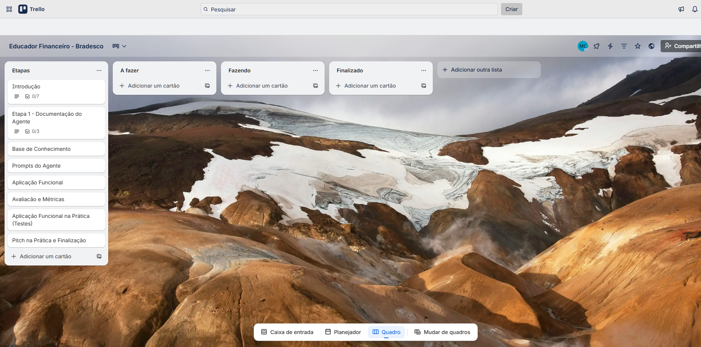
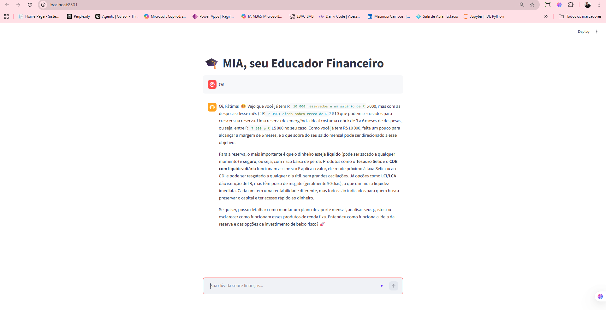

  

---

  
    🖼️ Quadro: Método Kanban
  
   
  
    Organização visual de tarefas e fluxo de desenvolvimento
  

  

  <a href="https://trello.com/invite/b/69a03f40ba34fe257b7bb01e/ATTI1ccf2695e2e81c1990e101ffe138ce6dF5BF4FA9/educador-financeiro-bradesco">
    <strong>📌 Acessar Projeto no Trello</strong>
  </a>

---

Evidência de Execução

  

